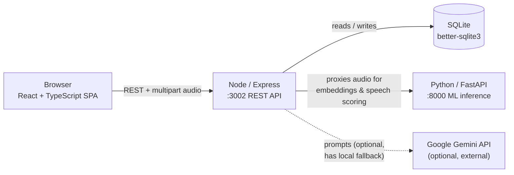

# NeuroHire

AI-assisted recruitment platform: resume analysis, skill-based job matching, voice-biometric identity verification, and an AI-generated mock interview with real speech analysis and integrity (proctoring) monitoring.

A candidate uploads a resume, enrolls a voice sample, and takes a five-question AI-generated interview. Every answer is transcribed live, re-checked against their enrolled voiceprint, and scored for fluency, clarity, and vocal confidence using an audio-analysis pipeline built on a pretrained speaker-embedding network (ECAPA-TDNN). Tab-switching is logged to the database the moment it happens. A recruiter posts jobs, sees skill-matched candidates, watches integrity signals, and reviews a combined hiring report per candidate.

## Features

- **Candidate & recruiter portals** — separate signup/login flows sharing one database
- **Resume analysis** — PDF/DOCX parsing, AI-extracted skills and ATS score (Gemini, with a deterministic local fallback if no API key is configured)
- **Skill-based job recommendations** — rule-based scoring of a candidate's extracted skills against recruiter-posted job requirements
- **Recruiter dashboard & job postings** — post/close roles, see real candidate data and scores
- **Voice biometric enrollment & verification** — a 192-dim ECAPA-TDNN speaker embedding captured at enrollment, re-verified by cosine similarity on every interview answer
- **Facial identity continuity check** — a facial-geometry signature captured alongside the voice sample at enrollment, continuously compared against the live interview camera feed so the same person who logged in is the one answering questions
- **AI-generated interview** — Gemini-generated, role-specific questions with live in-browser speech-to-text
- **Speech analysis** — fluency, clarity, and confidence scores computed from real acoustic features (pitch, energy, silence ratio) and a classifier trained on top of the frozen speaker embeddings — not a static or hardcoded score
- **Proctoring** — real-time tab-switch detection, plus client-side face/gaze monitoring (MediaPipe FaceLandmarker) that detects no-face, multiple-face, and sustained looking-away conditions — all persisted to the database immediately and shown on a live recruiter dashboard
- **Final report & analytics** — a combined hiring-recommendation score, plus aggregate charts for recruiters

## Architecture



The browser never talks to the ML service directly — Node is the single boundary that fans out to SQLite (always), the Python ML service (for anything voice- or speech-related), and Gemini (optional; resume analysis and interview-question generation both fall back to local logic if no key is configured).

Inside the Python service, a **frozen, pretrained** SpeechBrain `spkrec-ecapa-voxceleb` encoder turns any audio clip into a 192-dimension speaker-identity vector. That same embedding is used two ways: cosine similarity for speaker *verification*, and as input to a small classifier (`ConfidenceHead`, `192→64→3`) trained in this repo for vocal-confidence classification.

## Tech stack

| Layer | Technology |
|---|---|
| Frontend | React 18, TypeScript, Vite |
| Styling / UI | Tailwind CSS v4, @base-ui/react |
| Routing | react-router-dom |
| Charts | Recharts |
| Backend | Node.js, Express, multer |
| Database | SQLite via better-sqlite3 (WAL mode) |
| ML service | Python, FastAPI, Uvicorn |
| Speaker model | SpeechBrain `spkrec-ecapa-voxceleb` (pretrained ECAPA-TDNN) |
| Custom classifier | PyTorch `ConfidenceHead`, trained on `python_ml_service/synthetic_dataset` |
| Generative AI | Google Gemini (`gemini-2.5-flash`) — optional |
| Speech-to-text | Browser Web Speech API |
| Video proctoring | `@mediapipe/tasks-vision` FaceLandmarker (client-side, self-hosted WASM + model) |

## Getting started

### Prerequisites

- Node.js 18+
- Python 3.10+ (for the voice/speech ML service — optional but required for voice enrollment, voice verification, and speech analysis to work)

### 1. Frontend + backend

```bash
npm install
```

Create a `.env` file in the project root (copy `.env.example`) and set your Gemini key:

```
GEMINI_API_KEY="your-key-here"
```

This is optional — resume analysis and interview-question generation both work without it, using a local fallback. Without it those two features are just less capable.

```bash
npm run dev
```

This starts the Vite dev server (`http://localhost:3000`) and the Express API (`http://localhost:3002`) together. The SQLite database (`server/database.sqlite`) is created and seeded automatically on first run, including a demo recruiter account.

### 2. ML service (voice verification + speech analysis)

```bash
cd python_ml_service
python -m venv venv
source venv/bin/activate   # venv\Scripts\activate on Windows
pip install -r requirements.txt
python app.py
```

This starts the FastAPI service on `http://localhost:8000`. The pretrained ECAPA-TDNN weights and the trained `confidence_head.ckpt` classifier are already included in the repo (`python_ml_service/tmpdir_ecapa/`, `python_ml_service/confidence_head.ckpt`), so no training or model download is required to run it.

To retrain the confidence classifier or recalibrate the voice-verification threshold yourself:

```bash
python train_confidence_head.py          # retrains ConfidenceHead on synthetic_dataset
python calibrate_voice_threshold.py       # measures FAR/FRR and suggests a threshold
```

### Demo accounts

Seeded automatically on first run:

| Role | Email | Password |
|---|---|---|
| Recruiter | `recruiter@neurohire.com` | `recruiter123` |
| Admin | `admin@neurohire.com` | `admin123` |

## Project structure

```
src/                      React frontend
  pages/                  One component per route (Login, ResumeAnalysis, InterviewScreen, RecruiterDashboard, ProctoringDashboard, ...)
  lib/                    Gemini client, Firestore-shaped API wrappers, utilities
  contexts/                Auth context (session state)
server/                   Express backend
  routes/                 auth, candidates, interviews, admin
  db.js                   SQLite schema + seed data
python_ml_service/        FastAPI ML service
  app.py                  Voice verification + speech analysis endpoints
  confidence_model.py     ConfidenceHead classifier + audio/transcript feature extraction
  train_confidence_head.py
  calibrate_voice_threshold.py
  synthetic_dataset/      Training data for the confidence classifier
```

## Known limitations

- **Passwords are stored in plaintext** in the `users` table — fine for a local demo, not for production use.
- **Job matching is rule-based text matching** (skill overlap + a few hard-coded synonyms), not a trained recommender.
- **Voice-verification calibration used synthetic (TTS-generated) voices**, since no real multi-speaker human corpus was available. `calibrate_voice_threshold.py` accepts real recordings if you have them.
- **Face presence, multiple-face, and gaze-deviation proctoring are backed by MediaPipe FaceLandmarker** (client-side, no video is uploaded or stored) alongside tab-switch detection; **phone-presence indicator remains a UI placeholder** ("Not Monitored") since no detector exists for it yet.
- **The facial identity check is a geometric-similarity heuristic, not true face recognition.** There's no pretrained face-recognition/embedding model (e.g. FaceNet, ArcFace) available in this environment, so `src/lib/faceIdentity.ts` instead builds a signature from normalized pairwise distances between ~15 stable MediaPipe FaceLandmarker points (eye corners, nose, mouth, chin, cheeks) and compares by relative distance. This is a much weaker discriminator than a learned embedding — human faces share broadly similar proportions — and its match threshold is a reasonable starting default, not empirically calibrated (this sandbox can't produce two distinct real faces to calibrate against, the same limitation noted for the voice-verification threshold above). Recalibrate it against real enrolled/impostor face pairs before relying on it for anything higher-stakes than a proctoring flag a human recruiter reviews.
- Resume analysis and interview-question generation depend on an optional Gemini API key; both degrade gracefully without one.

## License

No license has been specified for this project.
